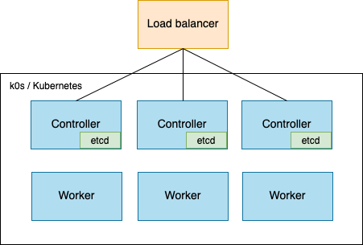

# Control Plane High Availability

You can create high availability for the control plane by distributing the control plane across multiple nodes and installing a load balancer on top. Etcd can be colocated with the controller nodes (default in k0s) to achieve highly available datastore at the same time.



## Network considerations

You should plan to allocate the control plane nodes into different zones. This will avoid failures in case one zone fails.

For etcd high availability it's recommended to configure 3 or 5 controller nodes. For more information, refer to the [etcd documentation](https://etcd.io/docs/latest/faq/#why-an-odd-number-of-cluster-members).

## Load Balancer

Control plane high availability requires a tcp load balancer, which acts as a single point of contact to access the controllers. The load balancer needs to allow and route traffic to each controller through the following ports:

- 6443 (for Kubernetes API)
- 8132 (for Konnectivity agent)
- 8133 (for Konnectivity server)
- 9443 (for controller join API)

The load balancer can be implemented in many different ways and k0s doesn't have any additional requirements. You can use for example HAProxy, NGINX or your cloud provider's load balancer.

### Example configuration: HAProxy

Change the default mode to tcp under the 'defaults' section of haproxy.cfg.

Add the following lines to the end of the haproxy.cfg:

```txt
frontend kubeAPI
    bind :6443
    default_backend back
frontend konnectivityAgent
    bind :8132
    default_backend back
frontend konnectivityServer
    bind :8133
    default_backend back
frontend controllerJoinAPI
    bind :9443
    default_backend back

backend back
    server k0s-controller1 <ip-address1>
    server k0s-controller2 <ip-address2>
    server k0s-controller3 <ip-address3>
```

Restart HAProxy to apply the configuration changes.

## k0s configuration

The load balancer address must be configured to k0s either by using `k0s.yaml` or by using k0sctl to automatically deploy all controllers with the same configuration:

### Configuration using k0s.yaml (for each controller)

Note to update your load balancer's public ip address into two places.

```yaml
spec:
  api:
    externalAddress: <load balancer public ip address>
    sans:
    - <load balancer public ip address>
```

### Configuration using k0sctl.yaml (for k0sctl)

Add the following lines to the end of the k0sctl.yaml. Note to update your load balancer's public ip address into two places.

```yaml
  k0s:
    config:
      spec:
        api:
          externalAddress: <load balancer public ip address>
          sans:
          - <load balancer public ip address>
```

For greater detail about k0s configuration, refer to the [Full configuration file reference](configuration.md).